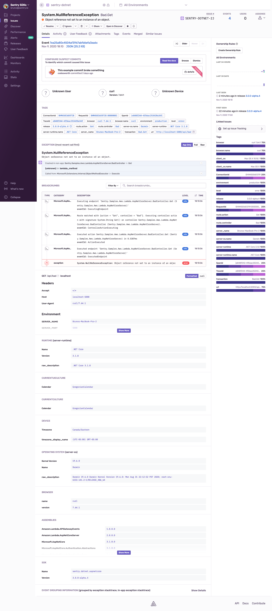

# Sample AWS Lambda ASP.NET Core Server app

To test it locally:

1. Add your own [DSN](https://docs.sentry.io/product/sentry-basics/dsn-explainer/) to [appsettings.json](appsettings.json).
2. Run the local server: `dotnet run`
   * You can also publish to AWS to test it
3. Hit the bad endpoint:  

```
$ curl -X GET -I http://localhost:5000/api/bad

HTTP/1.1 500 Internal Server Error
Date: Mon, 09 Nov 2020 23:10:06 GMT
Server: Kestrel
Content-Length: 0

```

An event will now show up in Sentry within a couple of seconds, like below.

Note the event shows only the application frames by default. You can click _Full_ to see the complete stack trace.
There's also a list of logs for that one request. Logs are taken via the ASP.NET Core logging integration.
By default calls to `LogInfo` and higher are stored as breadcrumbs. `LogError` is sent to Sentry as an event.
Events will include `HTTP` headers, and other relevant information helpful to identify the source of the issue.


