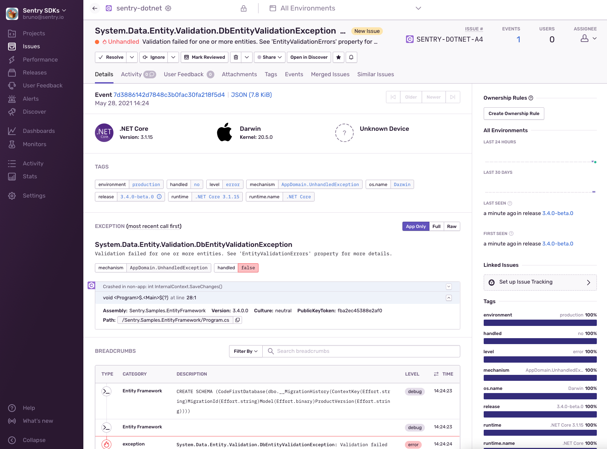
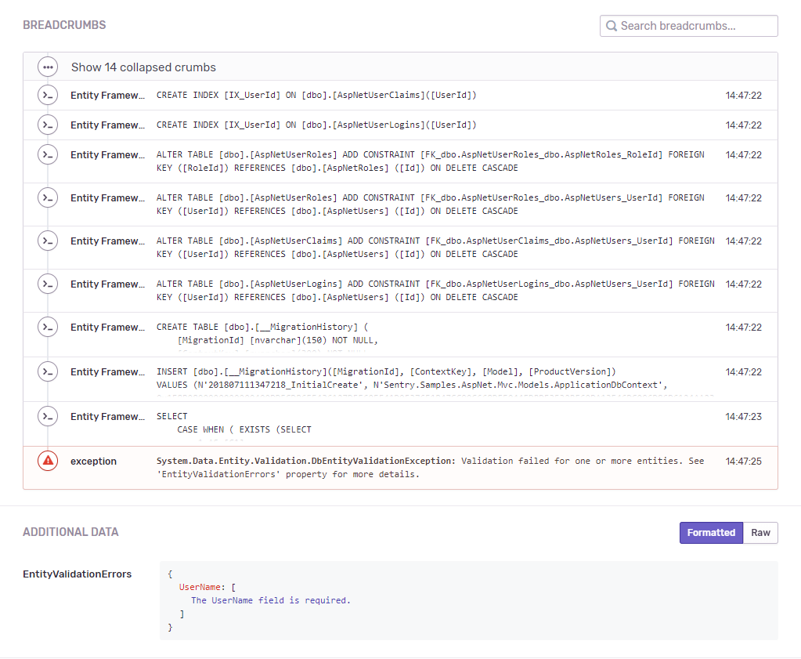

# Entity Framework 6 sample

If you're using Entity Framework Core, you don't need the package used in this sample.
Sentry can integrate with EF Core through `Sentry.Extensions.Logging` already.
Sentry.EntityFramework` is used to integrated with EF 6 only.

Breadcrumbs for different EF core events:

