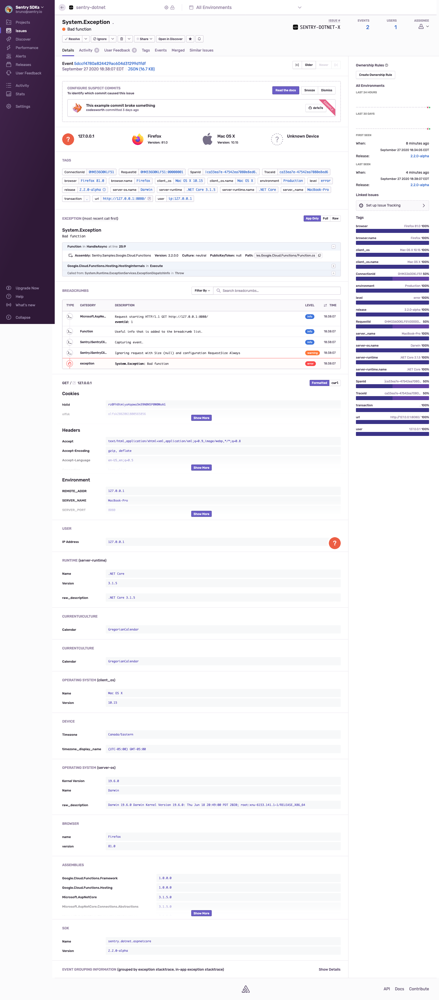

# Sample integration with Google Cloud Function

Edit the `appsettings.json` file and add your own `DSN`.
You can get one at [sentry.io](sentry.io).

Run this sample:

```sh
dotnet run
```

Browse the URL: `http://127.0.0.1:8080/`.
An event will be sent to the DSN configured on `appsettings.json`.


