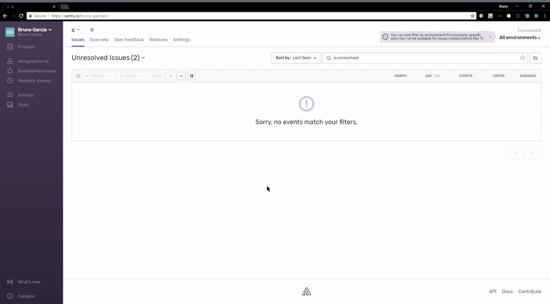

# Sample integration of log4net with Sentry

This is a simple console application that demonstrates how you can add Sentry to your applications using log4net.

`Program.cs` doesn't have any reference to Sentry. In fact, it doesn't even include a `using Sentry;` directive.
The integration is simply done by adding the [Sentry.Log4Net](https://www.nuget.org/packages/Sentry.Log4Net) package to you project and configuring the appender via xml.

It's also possible to use the SDK directly on your app as the documentation describes.
If you for example call `SentrySdk.AddBreadcrumb("crumb")`, all log4net events will include that breadcrumb.

**Please refer to the [documentation for details](https://getsentry.github.io/sentry-dotnet/).**

## Running this sample

> First modify the `app.config` and add **your own DSN**. You can get one at   [sentry.io](sentry.io). This will make sure you can see the result of running this app by looking at what this creates in Sentry.

Now you're ready to run the code.

You can run this sample with Visual Studio, or via the command line.

With the .NET Core SDK:

```sh
λ dotnet run
2018-07-21 21:59:40,704 [1] DEBUG Program - Debug message which is not sent.
2018-07-21 21:59:40,716 [1] INFO  Program - InfoFormat: About to throw NotImplementedException type of exception.
2018-07-21 21:59:40,866 [1] ERROR Program - Error: with exception
System.NotImplementedException: The method or operation is not implemented.
   at Program.DoWork()
   at Program.Main()
```

This will capture two events in Sentry. Since the `csproj` was modified to set a version, the SDK is able to detect the version and Sentry will display the `release` affected.

The appender was configured to capture the `User` of the application. Note that is has to be explicitly opted-in.



