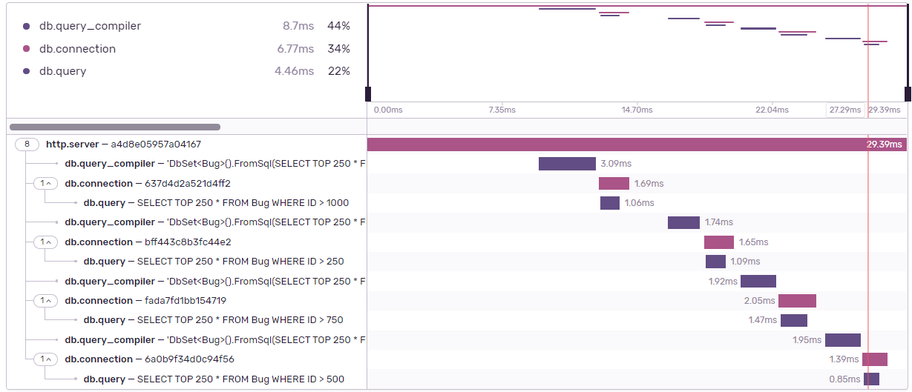
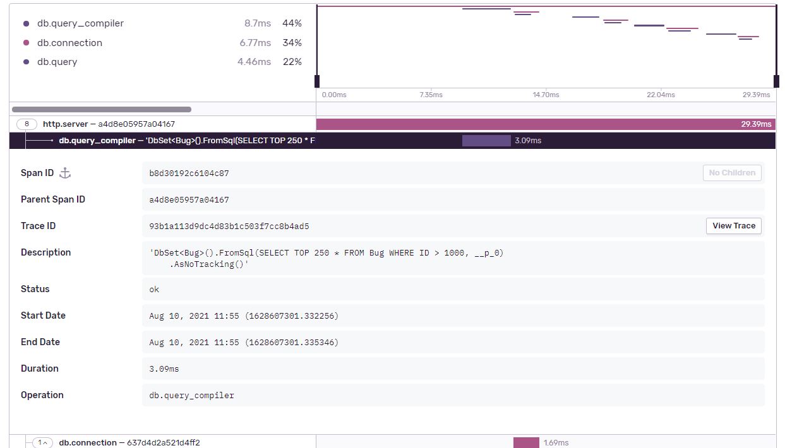
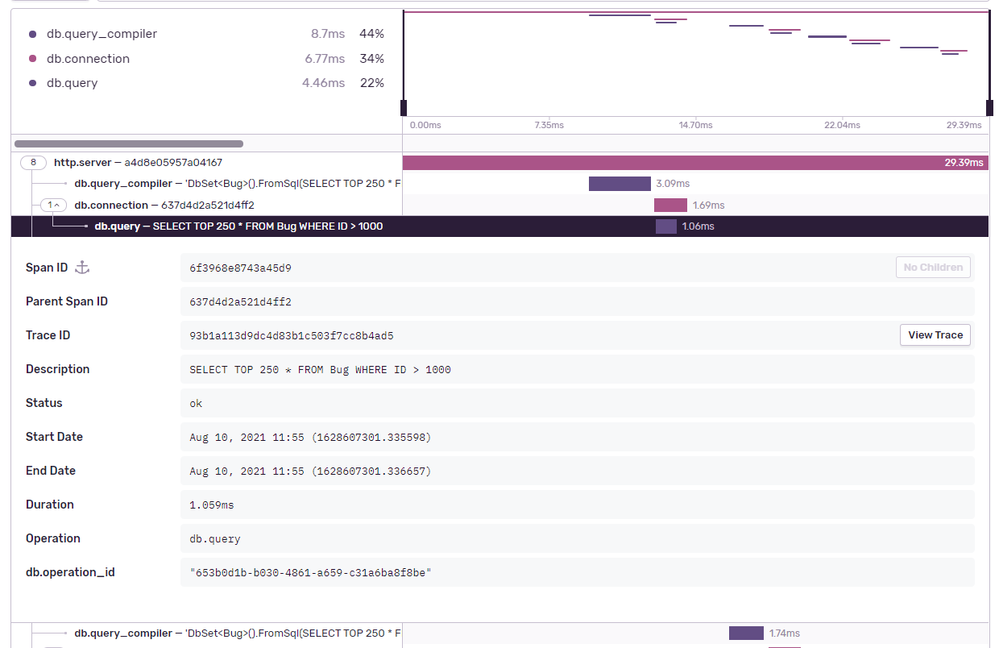

<p align="center">
  <a href="https://sentry.io" target="_blank">
    
  </a>
</p>

_Bad software is everywhere, and we're tired of it. Sentry is on a mission to help developers write better software faster, so we can get back to enjoying technology. If you want to join us [<kbd>**Check out our open positions**</kbd>](https://sentry.io/careers/)_

### About Sentry DiagnosticSource

Sentry Diagnostic Source Adds additional logging capabilities to the main SDK, such as, transactions with richer contexts, including database measurements, by integrating Entity Framework Core and SQLClient.

### When shouldn't I include this package

You will not need to include this package into your project if your project matches one of the following criteria:

* Your project Targets .NET Core 3 or greater.
* Your project includes the nuget [Sentry.AspNetCore](https://www.nuget.org/packages/Sentry.AspNetCore) version 3.9.0 or greater.
* Your project includes the nuget [Sentry.AspNet](https://www.nuget.org/packages/Sentry.AspNet) version 3.9.0 or greater.

### Using Sentry DiagnosticSource

To enable it, you'll need to call `AddDiagnosticSourceIntegration` During the SDK initialization:

```csharp
using Sentry;

SentrySdk.Init( option => {
    option.Dsn = "YOUR_DSN";
    option.AddDiagnosticSourceIntegration(); //Enables the diagnostic source integration.
});

```
NOTE: This setup is not required if your project targets .NET Core 3 or Greater (such as .NET 5 or higher) or if your project includes `Sentry.AspNet` or `Sentry.AspNetCore` NuGet.

After initializing the SDK, it will subscribe to the currently implemented integrations and start creating spans once metrified events starts to get invoked.

### Screenshots




