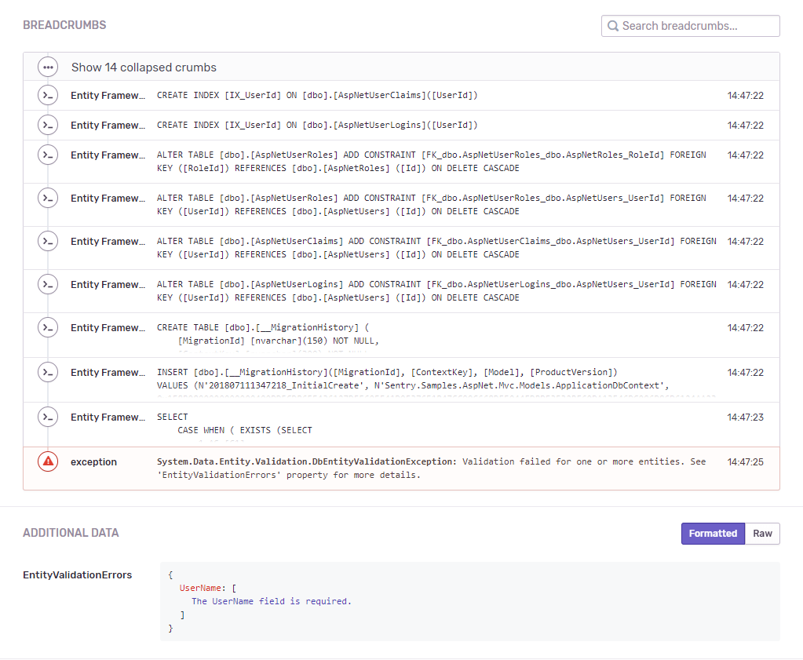



## Entity Framework 6 Integration for Sentry

This is a helper library to log Entity Framework 6 queries as *Breadcrumb*s and process `DbEntityValidationException`s to extract the validation errors and add to the *Extra* field of the data to help with debugging Entity Framework related errors.

## Usage

There are 2 steps to adding Entity Framework 6 support to your project:

* Call `SentryDatabaseLogging.UseBreadcrumbs()` to either your application's startup method, or into a static constructor inside your Entity Framework object. Make sure you only call this method once! This will add the interceptor to Entity Framework to log database queries.
* When setting up your `SentryClient`, use `SentryOptions.AddEntityFramework()`. This extension method will register all error processors to extract extra data, such as validation errors, from the exceptions thrown by Entity Framework.

## Samples

You may find a usage sample using ASP.NET MVC 5 under `/samples/Sentry.Samples.AspNet.Mvc`
